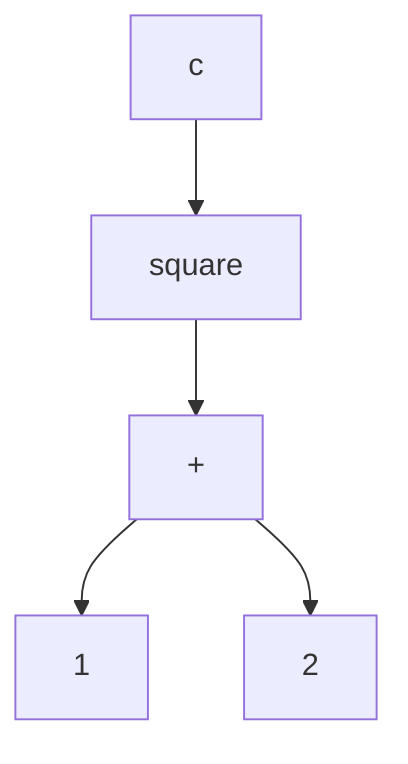
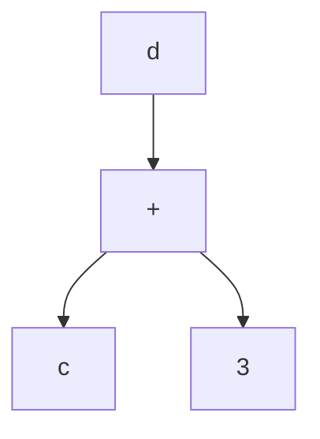
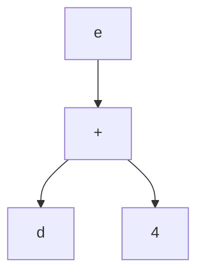

{: .note }
Hi! Ruining here. This lecture note covers slides 121-164 from [Data Palooza]() and the first 34 slides from [Function Palooza](). 

## Table of Contents
{: .no_toc }

{:toc}
- dummy item

## Destructors, Finalizers and Disposers
Many objects hold resources (e.g.: file handles, network connections) which need to be released when their lifetime ends. There are three ways this is handled in modern languages, namely destructors, finalizers, and disposal methods.

### Destructors
Destructors are only used in languages with manual memory management, like C++. There are deterministic rules that govern when destructors are run, so the programmer can ensure *all* of them will run, and control *when* they run. Since the programmer can control when they run, you can use destructors to release critical resources at the right times: e.g., freeing other objects, closing network connections, deleting files, etc. 

Here is an example of destructors in action in C++.
```cpp
void doSomeProcessing() {
   TempFile *t = new TempFile();
  
   ...
 
   if (dont_need_temp_file_anymore()) 
     delete t; // explicit call to a destructor
  
   ...
}

void otherFunc() {
  NetworkConnection n("www.ucla.edu");

  ...
} // destructor for n called when it goes out of scope
```

### Finalizers
In GC languages, memory is reclaimed automatically by the garbage collector. So finalizers are used to release unmanaged resources like file handles or network connections, which aren't garbage collected. Unlike a destructor, a finalizer may not run at a predictable time or at all, since objects can be garbage collected at any time (or not at all). Since they can't be counted on to run, they're considered a last-line of defense for freeing resources, and often not used at all! We'll learn more about finalizers when we cover Object Oriented Programming.

Here are some examples of finalizers in Java and Python.
```java
// Java finalization example
public class SomeClass {
 
  // called by the garbage collector
  protected void finalize() throws Throwable
  {
    // Free unmanaged resources held by SomeObj 
    ...
  }
}
```
```python
# Python finalizer method
class SomeClass :
  ...

  # called by the garbage collector
  def __del__(self):
     # Finalization code goes here
     ...
```

### Disposal methods
A disposal method is a function that the programmer must manually call to free non-memory resources (e.g., network connections). You use disposal methods in GC languages because you can't count on a finalizer to run. Disposal provides a guaranteed way to release unmanaged resources when needed. However, we run the risk of forgetting to call the disposal method.

Here is an example of a disposer in C#.
```cs
// C# dispose example
public class FontLoader : IDisposable
{
  ...
    
  public void Dispose()
  {
     // do manual disposal here, e.g., free
     // temp files, close network sockets, etc.
  }
}

...

var f = new FontLoader(...);
... // use f to draw fonts
f.Dispose();
```

## Variable Binding Semantics

**Variable binding semantics** describe how the name of a variable is related to the memory that stores its value. Turns out, this is *harder than you think*!

We'll cover four approaches:

1. **Value Semantics**: a variable is directly bound to storage that holds the value
2. **Reference Semantics**: a variable is directly bound to another variable's storage that holds the value
3. **Object Reference Semantics**: a variable is bound to a *pointer* that points to storage that holds the object/value
4. **Name Semantics**: a variable is bound to a *pointer* that points to an expression graph that evaluates the value

Unlike other concepts in this class, languages often mix-and-match their approaches! For example, C++:

- uses **value semantics** for primitive data types
- uses **reference semantics** with the reference operator (ex: `int &r = x;`)
- uses **object reference semantics** when explicitly referencing/dereferencing pointers

### Value Semantics

Value semantics is the simplest approach. Each variable name is directly bound to the storage that represents that variable.

In languages like C++ (which uses value semantics for primitive data types), local variables are stored on the stack in an "activation record". You can think of an activation record as a map from variable names to their direct values; the entire record lives in memory.

```cpp
// activation record: nothing!
int main() {
  int x = 5; // activation record: (x,5)
  int y = 0; // activation record: (x,5), (y,0)

  y = x;     // activation record: (x,5), (y,5)
}
// activation record: nothing!
```

When reassignment is done, like in the C++ example above, **the value is completely copied over**. After `y = x`, there is no relationship between `y` and `x` (other than their values being equal). This is distinction may seem obvious, but it's not true for other binding semantics!

{: .note }
Think about how this would work for non-primitive data types. You'd either have to copy over *every* field, which would be expensive, or copy over a pointer - which seems to break the "copying" rule. The former is so expensive that most languages do not implement it by default (colloquially, this is called deep copying).

### Reference Semantics

**Reference semantics** allows you to assign an *alias name* to an existing variable and read/write it through that alias. The reference variable functions identically to the previous variable. Unlike other binding strategies, it's really only relevant when you have *multiple* variables.

Take a look at this C++ example. Recall that in C++, we place an ampersand (`&`) in front of a variable declaration to make it a reference:

```cpp
int main() {
  string role = "SWE";
  string &truth = role; // binds truth to role

  truth = "QA"; // since truth points to the same mem location as role, this updates both!

  cout << "Addr of role: "  << &role << endl;
  cout << "Addr of truth: " << &truth << endl;
}
// both role and truth will have the value "QA"
// the printed addresses will be the same!
```

The key insight is that `&truth` isn't a pointer to the `role` variable; it points to the **same memory location** as `role`! When we update `truth`, we also update `role` (and vice-versa).

Another simple example is in the slides:

```cpp
int main() {
  int x = 5;
  int &r = x;
  r += 1;
  // at this point, *both* x and r have the value 6!
}
```

Under the hood, references are often implemented with pointers - this is how it works in C++!

{: .note }
Philosophically, you could argue that "both" is the wrong word to use - the variable and the reference copy are *the same thing*!

### Object Reference Semantics

**Object reference semantics** binds a variable name a pointer variable that itself points to an object or value. It's both very common and also a little confusing, so we'll spend a good chunk of time on this one!

(unlike reference semantics which hides its use of pointers, with object reference semantics the pointers are explicit and you can read/write them!)

Let's take a look at a Python example first. In Python, small integer literals like `5` and `20` are actually **allocated on the heap**; they aren't created and recreated every time a new variable is made. Instead, the activation record maps variables to pointers to items on the heap.

Let's take a look at what that implies:

```py
def main():
  x = 5     # x points to a 5 on the heap!
  y = 20    # y points to a 20 on the heap!
  y = x     # y is re-pointed to 5 on the heap; no values are copied!
            # instead, the *pointer* value for x is copied to y
            # at this point, the 20 can be garbage collected, since there are no references to it!
  y = y + 1 # y now points to a 6 on the heap;
            # x is unchanged!
```

There are two key behaviours to call out:

- on `y = x`, the **pointer values are copied**, but **not the memory itself**.
- on `y = y + 1`, `x` is unaffected, since we create a new object and change `y`'s pointer; not the underlying object!

Take a look at a more complicated object with fields:

```py
class Nerd:
 def __init__(self,name,iq):
  self.name = name
  self.iq = iq

 def study(self):
  self.iq = self.iq + 50

 def iq(self):
  return self.iq

 def myname(self):
  return self.name

def main():
 n1 = Nerd("Carey", 100) # points to a Carey nerd on the heap
 n2 = Nerd("Paul", 200)  # points to a Paul nerd on the heap
 n2 = n1                 # changes n2 to point to the Carey nerd;
                         # the Paul nerd can be GC'd!
 n1.study()              # changes the Carey nerd's IQ to 150
 print(f"{n2.myname()}'s IQ is {n2.iq()}") # n2 points to the Carey Nerd, so "Carey's IQ is 150"!
```

The confusion here is:

- `n2 = n1` doesn't change *any* underlying objects; it's just a pointer copy
- however, `n1.study()` changes a **field inside an object**.
    - a `150` is put on the heap, and `self.iq` now points to it
    - so, we've changed the field of an object through object reference!

The difference in how object reference semantics treats object assignment (`n2 = n1`) and field access (`n1.study()`) is important!

With this in mind: many languages use object reference semantics. Some use it for everything, like Python - others, like Java, only use it for complex objects (and value semantics for primitives).

#### Equality

With object reference semantics, we need to introduce some better tools that test for equality: two pointers with different values could point to the same block of memory!

- **Object Identity**: Do two object references refer to the same object at the same address in RAM.
- **Object Equality**: Do two object references refer to objects that have equivalent values (even if they're different objects in RAM).

Some languages, like Python, have `==` perform object equality by default. Others, like Java, perform object identity - this is why you shouldn't use `==` to compare strings in Java!


#### C++ Pointers

In C++, pointers explicitly perform object referencing semantics!

- when using `*` and `&` to interact with pointers, we change the underlying values
- without using `*` and `&`, we're instead changing the object references!

```cpp
// C++ pointer example

int main() {
  int x = 5, y = 6;
  int *px = &x; // pointer to the same memory block as x
  int *py = &y; // pointer to the same memory block as y

  *py = *px;    // changes the underlying memory, but not the pointers!
  py = px;      // changes the pointers, but not the underlying memory!
  *py = 42;     // changes the underlying memory, but not the pointers!
}

```

It's helpful to differentiate between the three different binding semantics by the different ways C++ lets you use them!

### Name and Need Semantics

**Name semantics** binds a variable name to a pointer that points to an expression graph called a "thunk".

{: .note }
Here, we mean graph in the computer science sense - nodes connected by edges!

Consider the Haskell expression:

```hs
square x = x*x
c = square (a + b)
```

We can draw the following graph to illustrate how the values are related to each other:


When a variable's value is needed (e.g., to be printed), the expression represented by the graph is "lazily evaluated" and a value is produced.

Languages like Haskell implement a variant of this called **"Need Semantics"** which memoize (cache) the result of each evaluation to eliminate redundant computations.

Here's one example where this memoization can save us computation time:

```hs
square x = x*x
c = square (1 + 2)
d = square (1 + 2) + 3
e = square (1 + 2) + 3 + 4
```

We can note that there are some redundant computations:

- `1 + 2`
- `square (1 + 2)`
- `square (1 + 2) + 3`

When we create an expression graph, there will be **redundant subgraphs**. Here are the compact versions of them (think about why they're equivalent!):








{: .note }
Memoization would only work if expressions return the same thing every time you call them - which is only true if your expressions **have no side effects**, like in Haskell!

{: .note }
If you're curious, Matt recommends [this blog post](https://apfelmus.nfshost.com/articles/lazy-eval-intro.html) for further reading!


## Function Palooza
In Function Palooza, we will be doing a deep dive into functions. 
We'll understand:
 - how functions pass arguments and receive parameters
 - how languages return values from functions
 - how languages communicate errors across functions
 - how functions can be passed as arguments, returned and stored in variables
 - how to design functions to operate on a variety of different types of inputs.

## Parameter Passing Semantics

Parameter Passing Semantics is the term we use to describe the underlying mechanisms that languages use to pass arguments (e.g., `x+y`) to functions (e.g., `f(x+y)`).

The four most common parameter passing semantics are:

* Pass by value: The formal parameter gets a copy of the argument's value/object
* Pass by reference: The formal parameter is an alias for the argument's value/object
* Pass by object reference: The formal parameter is a pointer to the argument's value/object
* Pass by name: The parameter points to an expression graph that represents the argument

As it turns out, these are closely related to binding semantics we learned!

### Pass by Value

Approach: Each argument is first evaluated to get a value, and a _copy_ of the value is then passed to the function for local use.

Take a look at the following C++ program, the parameter `n` in `stinkify` is passed by value:

```cpp
void stinkify(string n) {
  string t = n + " stinks!";
  n = t;
} 

int main() {
  string s = "Devan";

  stinkify(s);
  cout << s; // Prints "Devan"
}
```

When `stinkify(s)` is executed, the `n` in `stinkify`'s activation record is initially copied from `s` from `main`. When `n` is modified at the end of the function, it only affects the local copy without affecting the original argument `s` in main.


### Pass by Reference

Approach: _Secretly pass the address_ of each argument to the function. In the called function, all reads/writes to the parameter are directed to the data at the original address.

Let's looked at a slightly altered version of above program, where the parameter `n` is passed by reference instead (notice the "`&`" before `n`):

```cpp
void stinkify(string &n) {
  string t = n + " stinks!";
  n = t;
} 

int main() {
  string s = "Devan";

  stinkify(s);
  cout << s; // Prints "Devan stinks!"
}
```

This time when `stinkify(s)` is executed, the `n` in `stinkify`'s activation record points to the `s` in `main`'s activation record. This enables the formal parameter to act as an alias for the original value/object. Thus, each read/write of the formal parameter is directed to the original variable's storage. So the modification of `n` changes the `s` in `main`.

One byproduct that can be caused by pass by reference is **aliasing**. It occurs when two parameters unknowingly refer to the same value/object and unintentionally modify it. It can cause subtle and difficult bugs.

```cpp
void filter(set<int> &in,
            set<int> &out) {
  out.clear();
  for (auto x: in)
    if (is_prime(x)) out.insert(x);
}

int main() {
  set<int> a;
  // ... fill up a with #s
  filter(a, a);
}
```

The function `filter` is supposed copy all prime numbers from `in` into `out`. Although it seems to do the job perfectly, problem will occur when `in` and `out` refer to the same variable, as demonstrated with the call `filter(a, a)` above.

In the example, when `in` and `out` refer to `a`, `out.clear()` will clear the input `a` before it gets processed. This causes the wrong result to be generated.

### Pass by Object Reference

Approach: All values/objects are passed by (copy of the) pointer to the called function. The called function can use the pointer to read/mutate the pointed-to argument.

```python
class Nerd:
  def __init__(self, name, iq):
    self.name = name
    self.iq = iq

  def study(self):
    self.iq = self.iq + 50

# ... 

def be_a_nerd(n):
  n.study();

def main():
  a = Nerd("Alwyn", 150)
  be_a_nerd(a);
  print(a)
```

In the python code, the call `be_a_nerd(a)` copies the object reference `a` into the formal parameter `n` of function `be_a_nerd`. So within `be_a_nerd`, the local variable n points to our original object, which can be mutated through the object reference.

But there is one thing to remember: when we pass by object reference, we can't use assignment to change the value of the original value/object. Let's see the following example:

```python
def stinkify(n):
  t = n + " stinks!";
  n = t

def main():
  s = "Devan";

  stinkify(s);
  print(s); # Prints "Devan"
```

We might expect the assignment `n = t` to change the original variable `s` in the calling function. But in fact, the assignment only changes the _local_ object reference `n` to point to the storage of `t` in Heap Memory. It has no imact on the original object reference `s` or the object `s` points to.

The takeaway is that assignments of object references never change the passed-in value/object. They just change where the local object reference points to. It contrasts with passing by reference, where assignment can change the original value.

So, in a language that uses Object References like Java or Python, your function can either return a new object with relevant changes (e.g., `x = stinkify(x)`), or use mutator functions.

### Pass by Name/Need

Approach: Each parameter is bound to a pointer that points to an expression graph (a "thunk") which can be used to compute the passed-in argument's value.

Here, a trunk is typically implemented as a lambda function, which can be called to evaluate the full expression graph and produce a concrete result when it is needed.

Haskell is a notable example of pass by need.

```hs
func2 y =
  y^2+7

func1 x =
  func2 (3 + x)

main = do
  let z = func1 5
  print z
```

In pass-by-need, once an expression graph is evaluated, the computed result is _memoized_ (cached) to prevent repeat computation. For example, in the code above, if we do another `print z` after the existing print, the value of `z` will be cached without the need for another evaluation.

### Parameter Passing by Language

Let's look at some common language and the parameter passing scheme they use:

* C++: Pass by value/reference/object reference (pointer)/macro expansion
* Go: Pass by value (primitives)/object reference
* Haskell: Pass by need
* Java: Pass by value (primitives)/object reference
* JavaScript: Pass by value (primitives)/object reference
* Python: Pass by object reference

### Practice: Classify That Language: Parameter Passing

Consider the following program, which prints:

> q is 110
> x is 20, y is 60

What parameter passing strategy is this language using?

```rust
struct Record {
 x:i32,
 y:i32
}

fn change_value(v: &mut i32) {
  *v += 100;
}

fn change_struct(r: &mut Record) {
  r.x *= 2;
  r.y *= 3;
}

fn main() {
  let mut q:i32 = 10;
  change_value(&mut q);
  println!("q is {}", q);

  let mut rec = Record{x:10,y:20};
  change_struct(&mut rec);
  println!("x is {}, y is {}", rec.x, rec.y); 
}
```

Answer: This language is using a hybrid of pass-by-reference and pass-by-pointer. (This is rust)

```scala
def addIfFirstEven(a: => Int, b: => Int): Int = 
  var sum = a 
  if (a % 2 == 0)
    sum += b
  return sum

def triple(x: Int): Int =
   var trip: Int = x*3
   println("3*"+x+" is: "+trip)
   return trip

object Main {
 def main(args: Array[String]): Unit =
   var v1 = 1
   var v2 = 2
   var result = addIfFirstEven(v1,triple(v2))
   println("The result is: "+result) //prints "The result is: 1"
}
```
In this case, this is doing pass-by-name since the second argument of addIfFirstEven (`triple(v2)`) is only evaluated if the first argument (`v1`) is even. Since it's odd in this instance, the `triple` function never runs!
